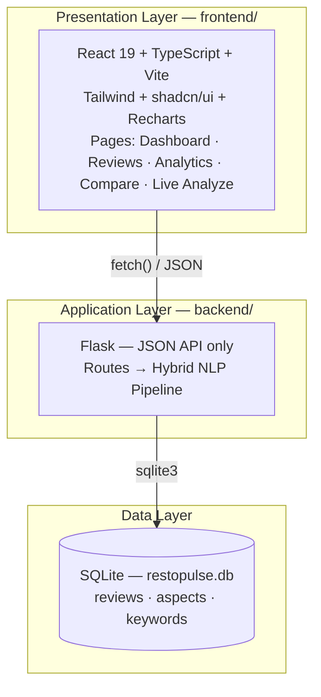
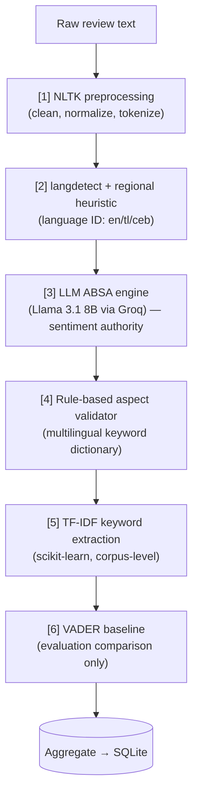
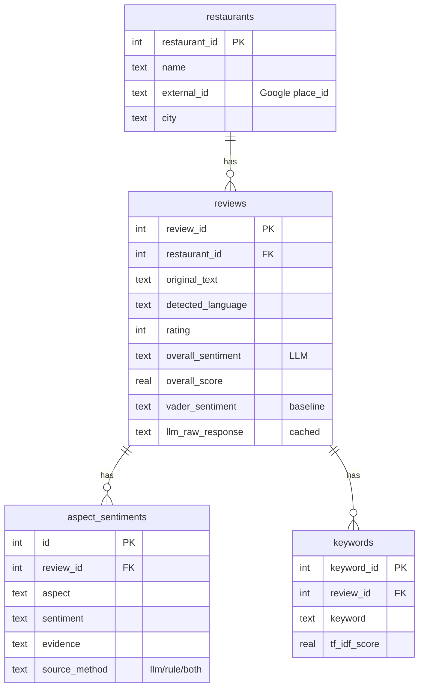

# RestoPulse — Multilingual Restaurant Review Sentiment Analysis System

**Project report**

---

## 1. Introduction

RestoPulse is a decision-support system that turns scraped Google restaurant
reviews into an aspect-based sentiment dashboard. It was built to help restaurant
owners and analysts understand *what* customers feel and *why* — across the
mix of languages real Filipino reviews are written in (English, Tagalog, Cebuano).

The core challenge is **multilingual sentiment analysis**: a single restaurant's
reviews are written in English, Tagalog, Cebuano, or a code-mixed blend ("Taglish"
/ "Bisaya-English"). Traditional English-only tools cannot read these reliably, so
RestoPulse uses a **hybrid NLP pipeline** that combines classical NLP techniques
with an open-source large language model.

## 2. Objectives

1. Collect a real corpus of restaurant reviews from multiple Mindanao cities.
2. Classify each review's **overall sentiment** (positive / neutral / negative).
3. Perform **Aspect-Based Sentiment Analysis (ABSA)** — per-aspect sentiment for
   *food, service, ambiance, price, cleanliness* — with supporting evidence.
4. Handle the **multilingual** nature of the corpus without translation loss.
5. Present the results in an interactive **dashboard**.
6. **Evaluate** the approach empirically against a traditional baseline.

## 3. Scope

- **Single-tenant demo** — no authentication or user accounts.
- **Batch processing** — reviews are analyzed once at ingest time and cached; the
  dashboard reads from a local database and works **offline**.
- **Data source** — publicly visible Google reviews, scraped once and stored.
  Reviewer names are treated as public/anonymizable; academic use only.

## 4. Dataset

| Property | Value |
|---|---|
| Total reviews | **390** |
| Restaurants | 10 |
| Cities | Cagayan de Oro (192), Iligan (149), Marawi (49) |
| Languages detected | English 346 · Tagalog 28 · Cebuano 14 · unknown 2 |
| Sentiment mix | 313 positive · 22 neutral · 55 negative |
| Average rating | 4.5 / 5 |

Reviews were scraped with a self-hosted Google Reviews scraper (no paid API),
capped at ~80 newest reviews per restaurant, normalized into a canonical CSV, then
ingested through the NLP pipeline into SQLite.

## 5. System Architecture

RestoPulse is a standard 3-layer web application.

**Key design rule:** LLM calls happen at **batch ingest time**, never at request
time. The dashboard reads only from SQLite, so the demo runs fully offline and is
reproducible (every LLM response is cached in the database).

### Technology stack

| Layer | Technology |
|---|---|
| Frontend | React 19, TypeScript, Vite, Tailwind CSS, shadcn/ui, Recharts |
| Backend | Python, Flask (JSON-only API), Flask-CORS |
| NLP | NLTK, langdetect, scikit-learn (TF-IDF), VADER, Groq + Llama 3.1 8B Instant |
| Database | SQLite |

## 6. The Hybrid NLP Pipeline

The pipeline has **six visible components** — five classical NLP techniques plus
one LLM. Reviews flow through them in order during ingest.

| # | Component | Type | Role |
|---|---|---|---|
| 1 | NLTK preprocessing | Classical | Lowercase, strip URLs/emojis, normalize, tokenize |
| 2 | langdetect + heuristic | Classical | Detect language; regional markers separate Cebuano/Tagalog |
| 3 | LLM (Llama 3.1 8B) | Modern | Overall + per-aspect sentiment, evidence, keywords as JSON |
| 4 | Rule aspect validator | Classical | Cross-check LLM aspects vs a curated multilingual keyword dictionary |
| 5 | TF-IDF | Classical | Statistically distinctive keywords across the corpus |
| 6 | VADER | Classical | English lexicon baseline — used **only** for evaluation |

**Why hybrid?** A pure English tool (VADER) cannot read Tagalog/Cebuano. A pure LLM
is accurate but offers no traditional-NLP baseline to justify the choice. The hybrid
design gives state-of-the-art multilingual accuracy *and* a visible, defensible set
of classical NLP components plus an empirical comparison.

The LLM is prompted to return strict JSON (`temperature=0` for reproducibility), with
schema validation and one retry on malformed output. A token-bucket throttle respects
the Groq free-tier rate limit, and every raw response is cached in the database.

## 7. Database Design

## 8. Dashboard (5 pages)

1. **Dashboard** — stat cards, sentiment donut, aspect bars, trend chart, top
   keywords, top-3 detected issues, language mix.
2. **Reviews** — filterable, paginated list; each row shows stars, language and
   sentiment badges, original text, and per-aspect chips with evidence.
3. **Analytics** — aspect performance, keyword insights, rating-vs-sentiment, and
   the **Pipeline Evaluation** tab (the hybrid-vs-VADER comparison).
4. **Compare** — city summaries and a restaurant leaderboard ranked by a
   **Bayesian-shrinkage-adjusted** health score, so small-sample restaurants can't
   unfairly out-rank well-reviewed ones.
5. **Live Analyze** — paste a review and get a live LLM ABSA result (the only
   feature that needs internet).

## 9. Evaluation

Both pipelines were run on a **50-review gold-standard test set**, stratified by
language (Cebuano/Tagalog oversampled) and spread across star ratings to avoid
positive-class inflation. Gold labels were **human-verified by reading each review's
text** (text wins over star rating). Predictions were read from the cached database —
fully reproducible, zero API tokens.

### Headline result

| Pipeline | Overall accuracy | Macro-F1 |
|---|---|---|
| VADER baseline | 58.0% | 0.579 |
| **Hybrid (LLM)** | **78.0%** | **0.687** |
| **Δ** | **+20.0%** | — |

### Per-language accuracy (where the baseline breaks)

| Language | n | VADER | Hybrid | Δ |
|---|---|---|---|---|
| Cebuano | 14 | 57.1% | 71.4% | +14.3% |
| English | 14 | 57.1% | 71.4% | +14.3% |
| Tagalog | 20 | 65.0% | 85.0% | +20.0% |

The hybrid pipeline beats the baseline on **every language**, with the largest gap
on Tagalog — exactly where an English-only lexicon is weakest. This is the empirical
justification for the hybrid architecture.

> Full per-class precision/recall/F1, confusion matrices, and per-aspect numbers are
> in `backend/evaluation/results.md`, regenerated by `evaluation/evaluate.py`.

## 10. Limitations & Honest Notes

- **Test set is small (50).** Each review is worth 2% of accuracy, so the 78% figure
  has a meaningful margin of error. It is best read as "≈80%, clearly above the 58%
  baseline."
- **Hybrid scored 78%, just under the 80% target** — within the noise of a 50-item
  set. The decisive, robust finding is the **+20-point gap over the baseline**.
- **Per-aspect accuracy is not yet independently validated** — aspect gold labels were
  seeded from the LLM, so those numbers are excluded from the headline comparison.
- **No Ilocano** in the corpus (all restaurants are in Mindanao); the system supports
  it but the data contains none.

## 11. Conclusion

RestoPulse demonstrates that a **hybrid NLP pipeline** — classical preprocessing,
language detection, rule-based aspect validation, and TF-IDF, combined with an
open-source LLM — handles multilingual Filipino restaurant reviews substantially
better than a traditional English-only baseline (**78% vs 58%**), while remaining
reproducible and offline-capable for demonstration. The system delivers an
end-to-end product: data collection, a hybrid analysis engine, an interactive
dashboard, and an empirical evaluation.

### Possible future work

- Expand the test set (50 → ~100+) for a more stable accuracy estimate.
- Independently verify aspect-level gold labels to validate ABSA accuracy.
- Add per-restaurant/per-city scoping to all dashboard charts (currently only the
  summary cards are scoped).
- Add authentication for a multi-tenant deployment.
